# Práctica: Estructuras no lineales en Java

## Datos del Estudiante
- **Nombre:** [Micaella Bustos Farías]
- **Curso:** [Estructura de Datos Gpo #1]
- **Fecha:** [17/06/2026]

---

## 1. Implementación de Estructuras no lineales

**Fecha:** [19/06/2026]

**Descripción:** Se realizó una práctica trabajando con nodos y árboles binarios. En el archivo IntTree.java se implementaron, usando recursividad, los métodos de recorrido PreOrder(primero se visita la raíz, luego el subárbol izquierdo y después el derecho), PosOrder(primero se visita los subárboles y al final la raíz), InOrder(como lo dice su nombre este hace un recorrido en orden ya sea ascendente y descendente), así como los métodos Height(calcular la altura del árbol) y Weight(calcular cantidad de nodos "peso del arbol"). Todos los métodos fueron resueltos aplicando un enfoque recursivo, reforzando la comprensión de cómo se procesan estructuras jerárquicas.

## Implementacion del codigo 
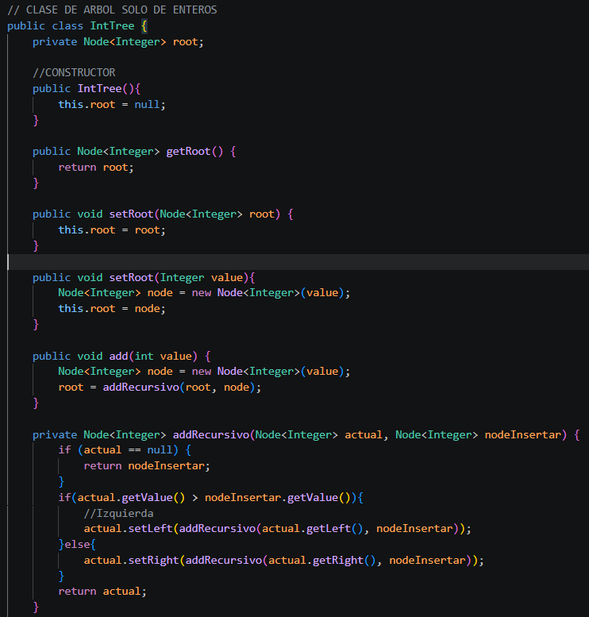
### PreOrden IntTree
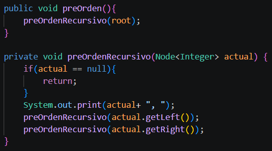
### PosOrden IntTree
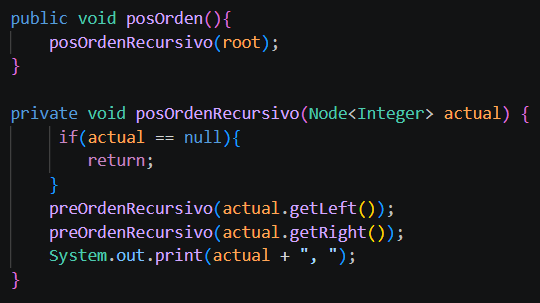
### InOrden IntTree
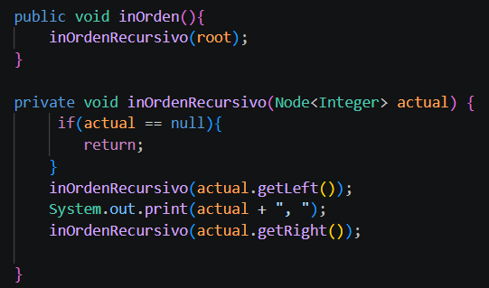
### Height IntTree
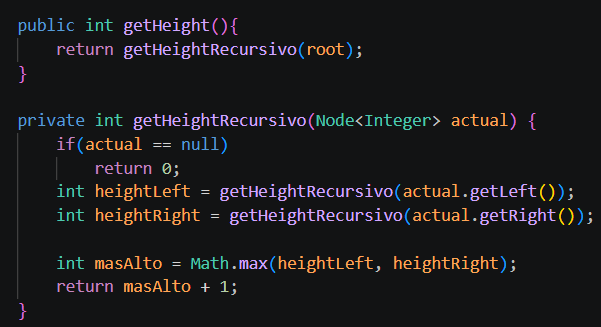
### Weight IntTree
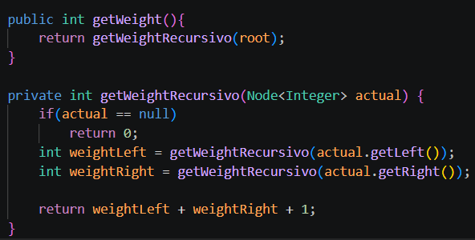
### App.java IntTree
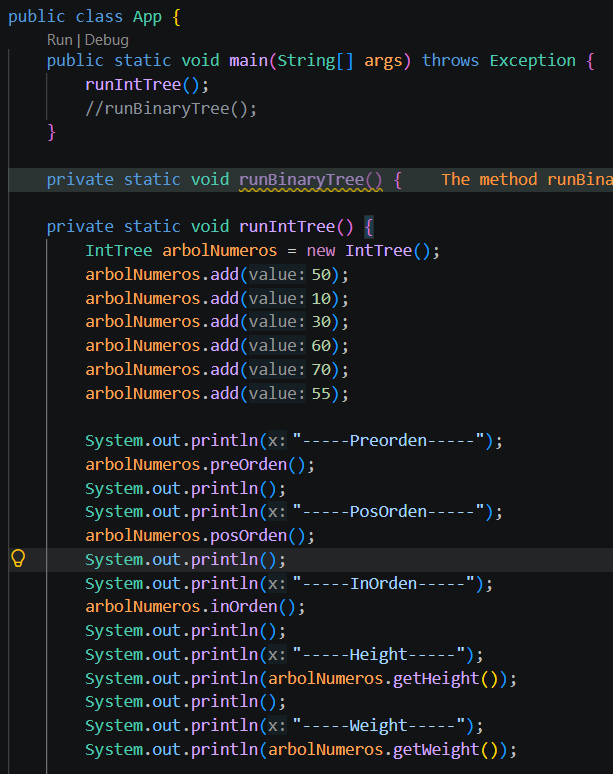

## Salida de consola
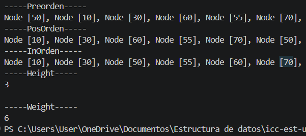

---
### Binarytree
**Descripción:** En la siguiente práctica se trabajó con una clase genérica BinaryTree<> extends Comparable<>, la cual permite almacenar cualquier objeto que implemente Comparable. Se creó la clase Persona con los atributos nombre y edad, haciendo uso de implements Comparable<> y sobrescribiendo el método compareTo para definir el criterio de orden. Luego, en BinaryTree, se implementó los mismos recorridos de la practica anterior.
## Implementacion del codigo 
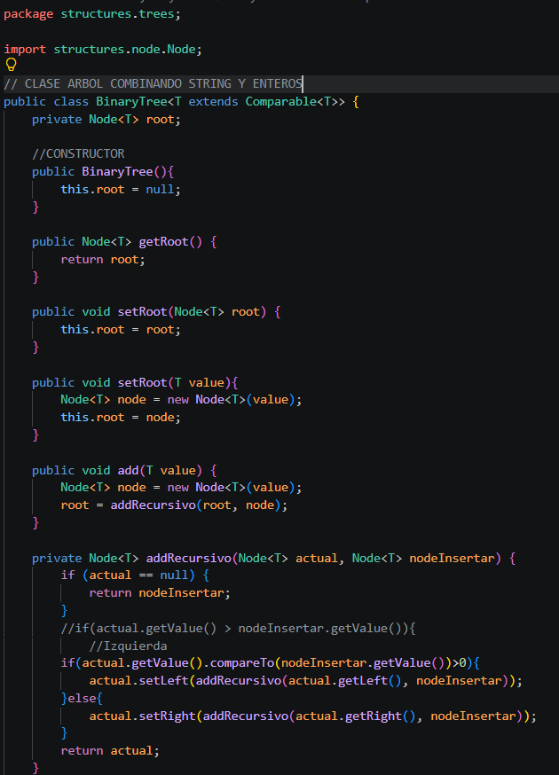
### PreOrden BinaryTree<>
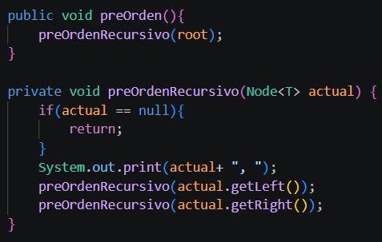
### PosOrden BinaryTree<>
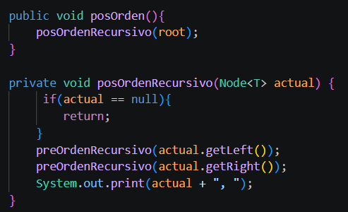
### InOrden BinaryTree<>
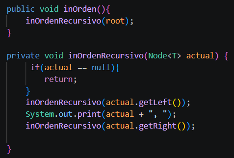
### Height BinaryTree<>
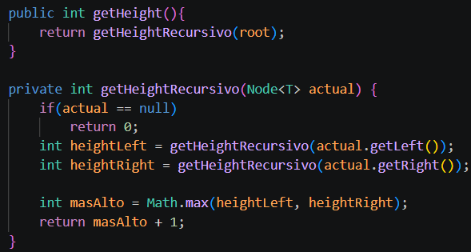
### Weight BinaryTree<>
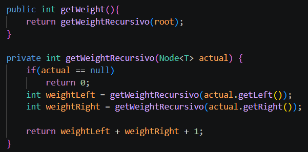
### App.java BinaryTree<>
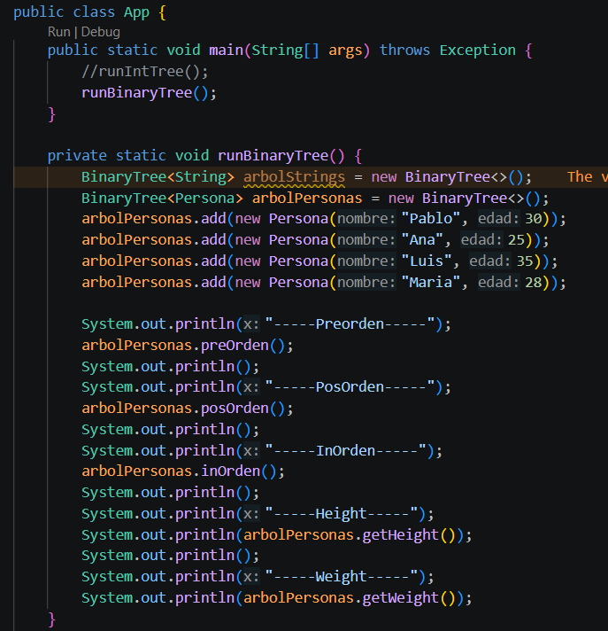

## Salida de consola
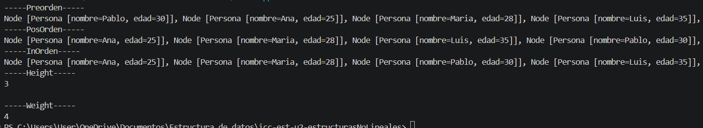