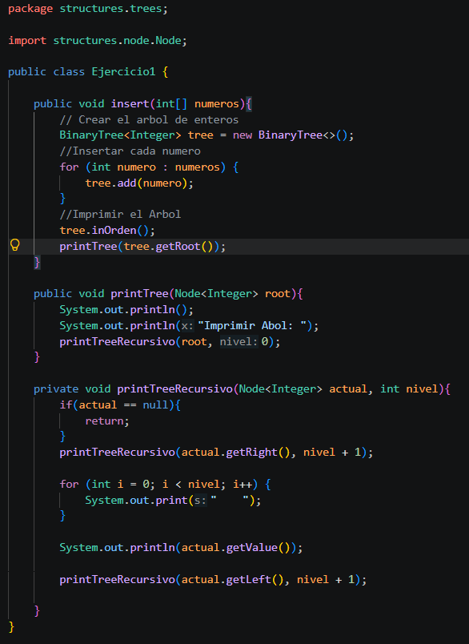
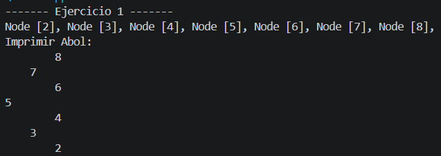
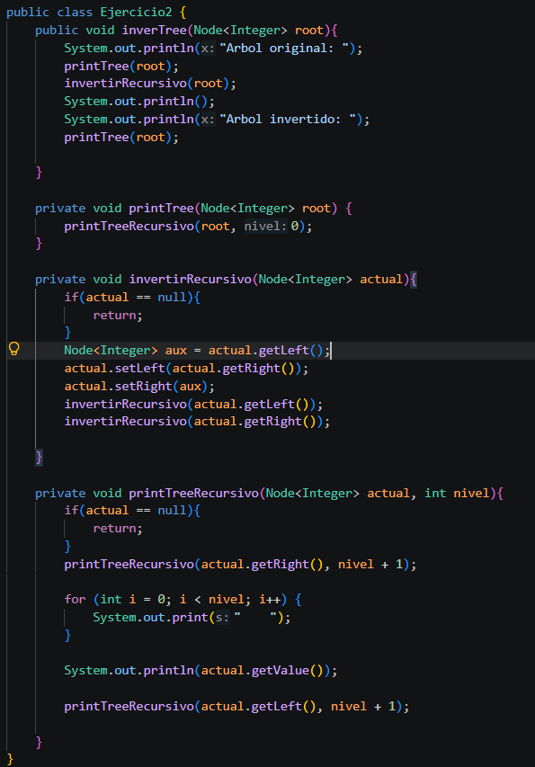
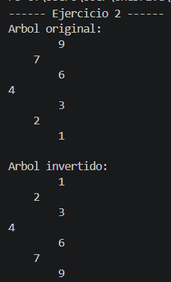
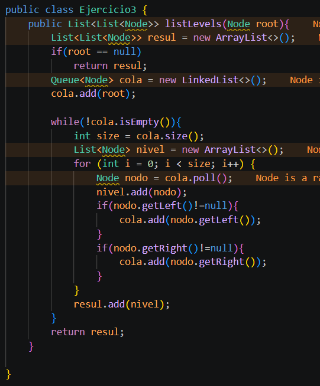
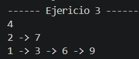
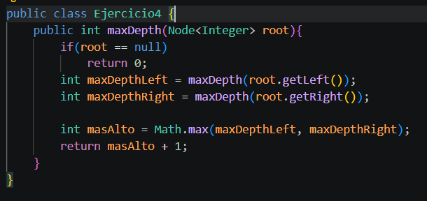
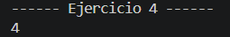
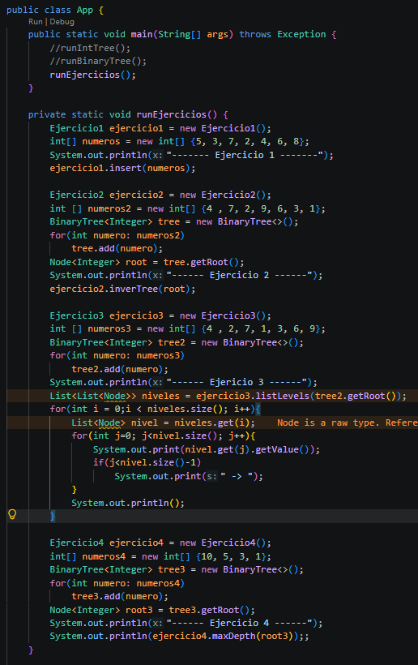

# Practica 04 - Ejercicios de logica con estructuras no linelaes: arboles
## Datos del Estudiante
- **Nombre:** [Micaella Bustos]
- **Curso:** [Estructura de Datos Gpo #1]
- **Fecha:** [22/06/2026]

## Descripcion General del Proyecto

En el siguiente proyecto se implementan arboles binarios y arboles binarios de busqueda para la resolucion de problemas logicos, asi mismo se realizaron algoritmos de insercion, inversion, recorrido por niveles y calculo de profundidad.

---

## Ejercicio 01: Insertar en un Arbol Binario de Busqueda

### Explicacion
En este ejercicio se implemento un metodo insert para crear nuestro arbol e insertar cada numero y para finalizar con su impresion.
Se implemento el metodo printTreeRecursivo el cual recibe como parametros el nodo actual y el nivel, tambien colocamos nuestro caso base que es cuando el nodo es null. Luego imprime el valor del nodo con identacion segun el nivel y se encarga de llamar recursivamente sobre el hijo derecho y el izquierdo.
### Codigo

### Salida de Consola

## Ejercicio 02: Invertir un Arbol Binario 

### Explicacion
En este ejericicio se trabajo diferente porque en el app.java se intancio de una vez el arbol, no se hizo uso del metodo insert. 
Se implemento el metodo inverTree que se encarga de imprimir el arbol original y el invertido. Se implemento el metodo invertirRecursivo, aqui tambien hacemos uso de nuestro caso base cuando el nodo es null, retorna sin hacer nada. Luego hacemos uso de un nodo auxiliar que intercambia el hijo izquierdo con el derecho y llama recursivamnete sobre ambos hijos. Tambien se reutilizo el metodo printTreeRecursivo del ejercicio anterior para imprimir el arbol con identacion segun el nivel.

### Codigo

### Salida de Consola

## Ejercicio 03: Listar Niveles en Listas Enlazadas

### Explicacion
En este ejericicio se intancio de una vez el arbol en el app.java, no se uso el metodo insert. 
Se implementa el metodo listLevels que recibe la raiz del arbol y esta retorna una lista de listas, en este caso cada lista contiene los nodos de un nivel. Se usa una Queue para recorrer el arbol por niveles. Nuestro caso base es cuando la raiz es null, retorna la lista vacia. En cada iteracion se toma el tamanio actual de la cola para saber cuantos nodos hay en el nivel, hacemos uso de poll que va extrayendo uno a uno, se agregan a la lista del nivel y se adhieren sus hijos izquierdos y derecho si existen.

### Codigo

### Salida de Consola

## Ejercicio 04: Calcular la Profundidad Maxima

### Explicacion
En este ejericio se intancio de una vez el arbol en el app.java, no se uso el metodo insert.
Se implemento el metodo maxDepth que recibe la raiz del arbol y retorna su profundidad maxima. El caso base es cuando el nodo es null este va a  retorna 0. Luego se llama recursivamente sobre el izquierdo y el derecho, el uso de Math.max toma el mayor de ambos y se le suma 1 para contar el nivel actual.

### Codigo

### Salida de Consola

### App.java

## Conslusiones
### Conclusión 1:
Permite aplicar los conceptos teóricos de árboles en problemas prácticos mediante inserción, inversion, recorrido por niveles y calculo de profundidad.
### Conclusión 2:
El desarrollo de los ejercicios fortalece el análisis de relaciones jerárquicas entre nodos y el uso de recursividad o recorridos para resolver problemas sobre árboles.

### Conclusión 3:
La implementacion y depuración del código ayuda a escribir soluciones más claras, documentadas y verificables mediante casos de prueba.